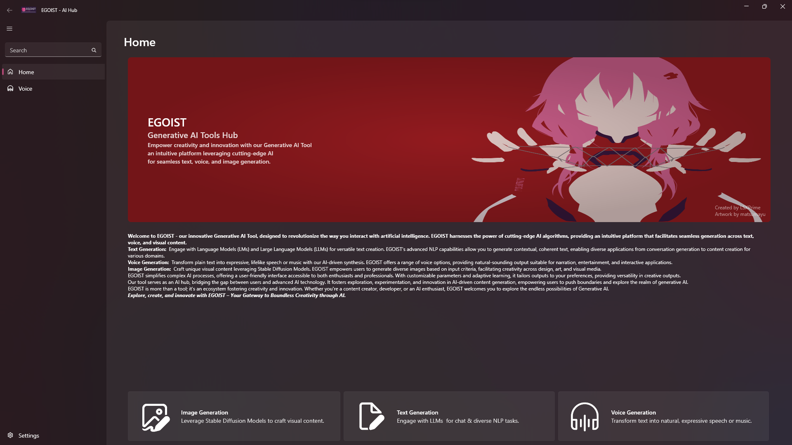
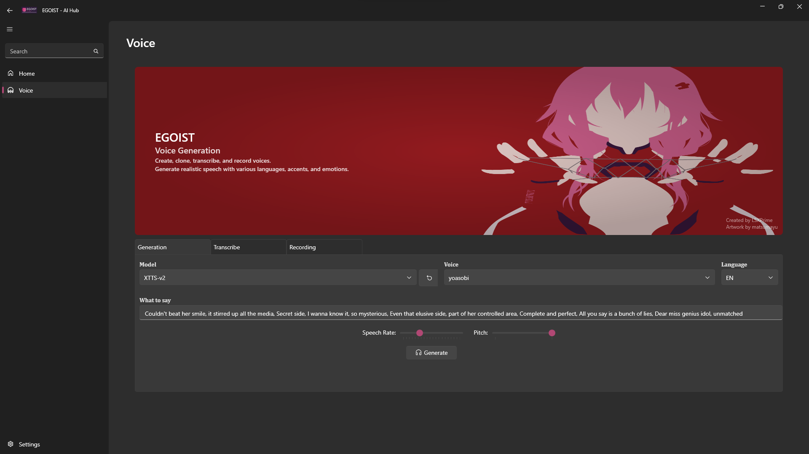
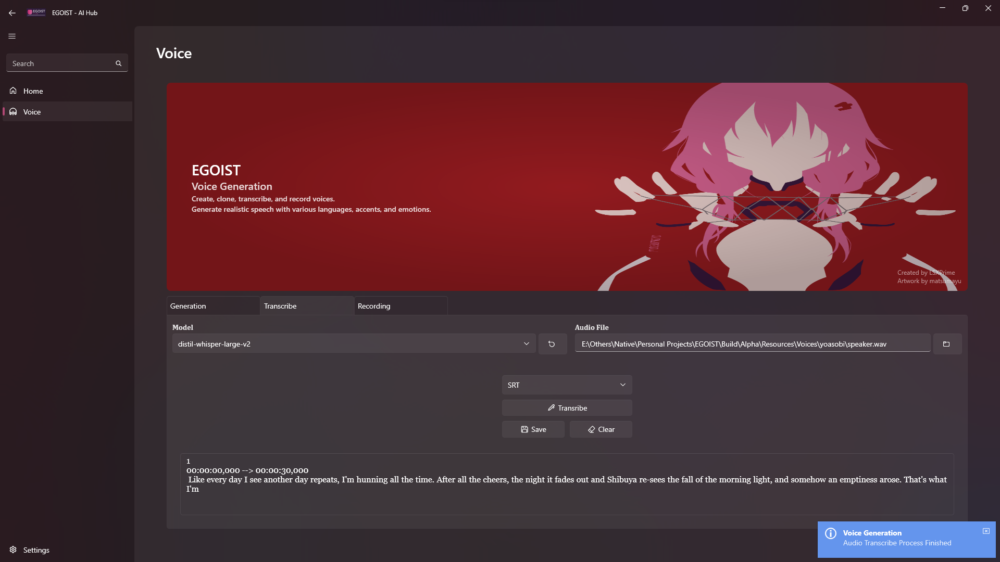
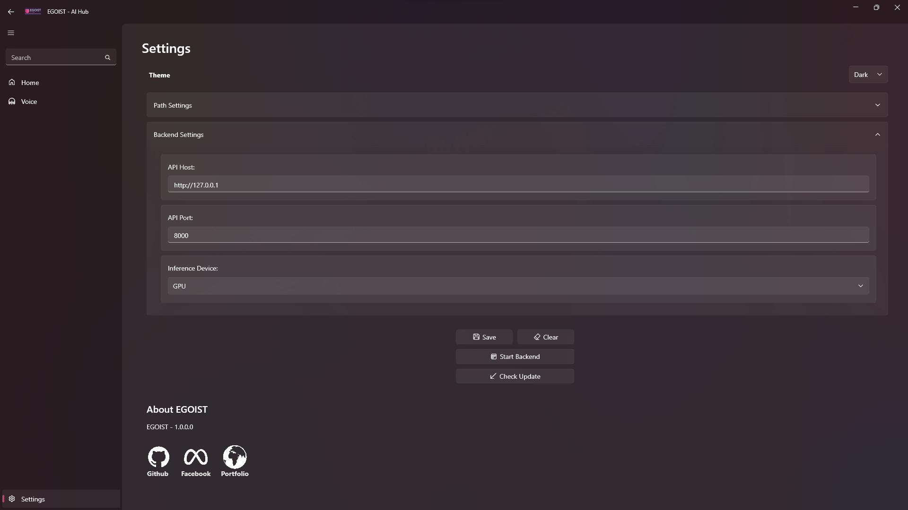

<h1 align="center">EGOIST - AI Hub</h1>

---

## Overview
A project that aims to simplify interaction with various AI models across different types such as voice, text, and image generation for the end user. It seeks to combine the majority of these features into a single tool, thereby saving storage and reducing the complexity involved in setting up separate tools for each task, achieved through automation.
 

## Features
**Presently, only voice-related tasks are implemented; please check the roadmap for updates.**

- Optimized for both CPU and Nvidia GPU operations.
- Automatic installation of dependencies, requiring only a lightweight executable.
- User-friendly interaction interface designed in accordance with the Fluent UI style.
- Dark and Light theme options for interface customization.
- Automated updates to ensure the latest functionalities.
- Support various tasks
	- **Generation Module**: Utilizes Coqui TTS & HuggingFace Transformers as backends to create synthetic voices, offering a range of languages, accents, and emotions.
	- **Transcription Module**: Employs whisper.cpp C# Bindings, also known as Whisper.Net, this module supports transcribing audio recordings into text or SubRip subtitle files automatically.
	- **Recording Module**: Supports voice recording and amplification for voice cloning tasks.

## Getting Started

1. Install .NET 7 runtime and Python 3.10.6 .
2. Proceed by either downloading the latest release and executing it or cloning the repository. 
3. Launch the backend by clicking the "Start Backend" button in the settings (This step is not necessary for transcription tasks).

> If you opt to clone the repository and compile it manually, make sure that the necessary dependencies are installed and configured. You have the option to compile it using Visual Studio 2022 or via `dotnet build`.

## Managing Models

1. Download your desired model and place its folder inside "Resources > Models > Checkpoints > {Image/Text/Voice/Generation Type} > {Model Task}".
2. From [EGOIST-Models-Catalog](https://github.com/LSXPrime/EGOIST-Models-Catalog), download the configuration file for your model and place it inside the respective model folder, **It's advisable to download the model using the links provided inside the configuration files.**

## Roadmap

**Text Generation**
- Utilizing llama.cpp and Transformers as backends
- Features:
    - [ ] Chat with AI assistant
    - [ ] Text completion
    - [ ] Interaction with local documents
    - [ ] Coding assistance & interpreter
    - [ ] Story-writing capabilities

**Image Generation and Editing**
- Employs Stable Diffusion and DragGAN as backends
- Features:
    - [ ] Text to Image
    - [ ] Image to Image
    - [ ] Image inpainting
    - [ ] Image manipulation
    - [ ] Face swapping

**Video Generation**
- Features:
    - [ ] Text to Video
    - [ ] Image to Video
    - [ ] Human pose animation synthesis

**Voice Generation**
- Utilizes Coqui TTS, Transformers, and Whisper.cpp as backends
- Features:
	- [x] Text to Speech ✅ 2023-12-15
	- [x] Voice Clone with Emotions ✅ 2023-12-15
	- [x] Audio Transcription ✅ 2023-12-15
	- [x] Audio Recording ✅ 2023-12-15
	- [ ] Retrieval-based Voice Conversion

**3D Art Generation**
- Features:
    - [ ] Creation of 3D models using Shape-E or DreamFusion
    - [ ] 3D human animations using MotionDiffusion 

## License

[AGPT-3](LICENSE )

## Disclaimer

>***The developers of EGOIST cannot be held responsible for any misuse of the application. Please use it responsibly and ethically.***

>We encourage exploration, contributions, and the enhancement of functionalities in this ai tool!
>
>Should you have any questions or encounter issues, please open an issue in this repository.

## Screenshots

