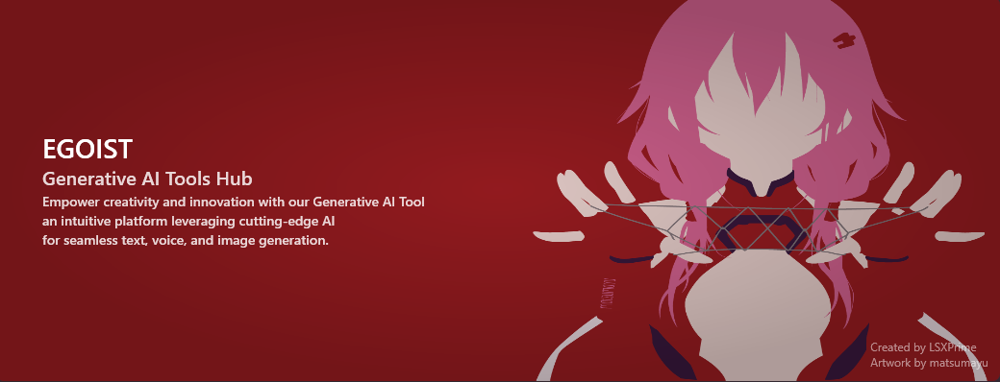

<h1 align="center">EGOIST - AI Hub</h1>

---

## Overview
A project that aims to simplify interaction with various AI models across different types such as voice, text, and image generation for the end user. It seeks to combine the majority of these features into a single tool, thereby saving storage and reducing the complexity involved in setting up separate tools for each task, achieved through automation.
 

## Features
- Optimized for both CPU and Nvidia GPU operations.
- Automatic installation of dependencies, requiring only a lightweight executable.
- User-friendly interaction interface designed in accordance with the Fluent UI style.
- Dark and Light theme options for interface customization.
- Automated updates to ensure the latest functionalities.
- Support various tasks
	- **Text Generation**
		- **Chat:** Engage in diverse conversations with AI, covering everyday chit-chat to expert advice.
		- **Text Completion:** Craft rich narratives with varied characters, settings, and themes, all powered by AI.
		- **Documents Memory:** Seamlessly integrate with documents, supported by semantic memory.
		- **Roleplay:** Dive into otaku fantasies with your favourite Waifu through AI-driven interactions, in single-turn or multi-turn group roleplays.
	- **Voice Generation**
		- **Voice Clone with Emotions:** Create synthetic voices with diverse emotions. 
		- **Audio Transcription:** Automatically transcribe audio recordings to text or subtitles.
		- **Audio Recording:** Record and amplify voices for cloning, all enhancing audio-related functionalities.
	- **Management**
		- **Downloads:** Choose from community-tested models on HuggingFace.
		- **Characters:** Explore created or downloaded roleplay characters with personalities and descriptions.
		- **Character Creator:** Build detailed character cards to instruct AI behavior, with the ability to import TavernAI characters.

## Getting Started

1. Install .NET 7 runtime & CUDA Toolkit 11.8 (for GPU Inference only) and Python 3.10.6 .
2. Proceed by either downloading the latest release and executing it or cloning the repository. 
3. Launch the backend by clicking the "Start Backend" button in the settings (This step is necessary only for TTS & voice cloning tasks).

> If you opt to clone the repository and compile it manually, make sure that the necessary dependencies are installed and configured. You have the option to compile it using Visual Studio 2022 or via `dotnet build`.

## Downloading Models

- ***Please check [EGOIST-Models-Catalog](https://github.com/LSXPrime/EGOIST-Models-Catalog) for details***

## Roadmap

**Text Generation**
- Utilizing llama.cpp and Transformers as backends
- Features:
    - [x] Chat with AI assistant
    - [x] Text completion
    - [x] Interaction with local documents
    - [x] Roleplay with characters
    - [ ] Coding assistance & interpreter
    - [ ] Story-writing capabilities
    - [ ] Markdown Rendering 

**Image Generation and Editing**
- Employs Stable Diffusion and DragGAN as backends
- Features:
    - [ ] Text to Image
    - [ ] Image to Image
    - [ ] Image inpainting
    - [ ] Image manipulation
    - [ ] Face swapping

**Video Generation**
- Features:
    - [ ] Text to Video
    - [ ] Image to Video
    - [ ] Human pose animation synthesis

**Voice Generation**
- Utilizes Coqui TTS, Transformers, and Whisper.cpp as backends
- Features:
	- [x] Text to Speech
	- [x] Voice Clone with Emotions
	- [x] Audio Transcription
	- [x] Audio Recording
	- [ ] Retrieval-based Voice Conversion

**3D Art Generation**
- Features:
    - [ ] Creation of 3D models using Shape-E or DreamFusion
    - [ ] 3D human animations using MotionDiffusion

**Cross-Platform Support**
- [ ] Replace WPF UI Framework (Avalonia / Uno)
- [ ] Release Linux Binaries
- [ ] Release MacOS Binaries

## License

[AGPT-3](LICENSE )

## Disclaimer

>***The developers of EGOIST cannot be held responsible for any misuse of the application. Please use it responsibly and ethically.***

>We encourage exploration, contributions, and the enhancement of functionalities in this ai tool!
>
>If you have any questions or encounter issues, please open an issue in this repository.

## Screenshots

![[Screenshots/Screenshot_01.jpg]]
![[Screenshots/Screenshot_02.jpg]]
![[Screenshots/Screenshot_03.jpg]]
![[Screenshots/Screenshot_04.jpg]]
![[Screenshots/Screenshot_05.jpg]]
![[Screenshots/Screenshot_06.jpg]]
![[Screenshots/Screenshot_07.jpg]]
![[Screenshots/Screenshot_08.jpg]]
![[Screenshots/Screenshot_09.jpg]]
![[Screenshots/Screenshot_10.jpg]]
![[Screenshots/Screenshot_11.jpg]]
![[Screenshots/Screenshot_12.jpg]]
![[Screenshots/Screenshot_13.jpg]]
![[Screenshots/Screenshot_14.jpg]]
